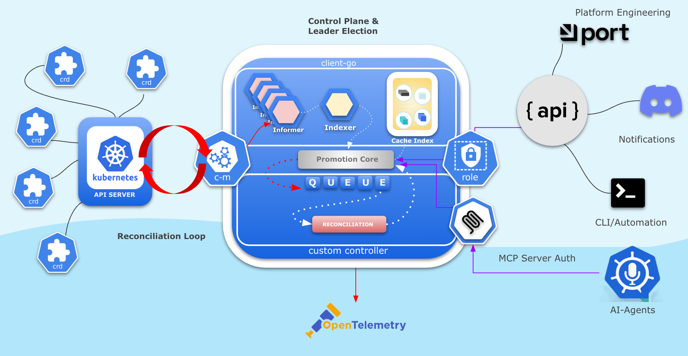

# Golang Kubernetes Controller Tutorial

This project is a step-by-step tutorial for DevOps and SRE engineers to learn about building Golang applications and Kubernetes controllers. Each step is implemented as a feature branch and includes a README section with explanations and command history.

## Roadmap

This tutorial guides you through building a production-grade Golang Kubernetes controller, step by step:

1. **Golang CLI Application using Cobra** — Initialize a CLI app with cobra-cli.
2. **Zerolog for Log Levels** — Add structured logging with zerolog.
3. **pflag for Log Level Flags** — Integrate pflag for CLI log level flags.
4. **FastHTTP Server Command** — Add a server command with configurable port and log level.
5. **Makefile, Dockerfile, and GitHub Workflow** — Introduce build automation, secure containerization, CI/CD, and tests.
6. **List Kubernetes Deployments with client-go** — List deployments in the default namespace.
7. **Deployment Informer with client-go** — Watch and log Deployment events.
8. **/deployments JSON API Endpoint** — Serve deployment names as JSON from the informer cache.
9. **controller-runtime Deployment Controller** — Reconcile Deployments and log events.
10. **Leader Election and Metrics** — Add HA and metrics endpoint to the controller manager.
11. **FrontendPage CRD and Advanced Controller** — Define a custom resource and manage Deployments/ConfigMaps.
12. **Platform API (CRUD + Swagger)** — Add RESTful CRUD API and Swagger UI.
13. **MCP Integration** — Integrate MCP server for multi-cluster management.
14. **JWT Authentication** — Secure API endpoints with JWT.
15. **OpenTelemetry Instrumentation** — Add distributed tracing with OpenTelemetry.

---


## Dev Environment (GitHub Codespaces)
### Recommended way:
 - 1. develop and test your code with envtest k8s control plane first (we use it on step7)
 - 2. test controller with local kind cluster (find example)
 - 3. deploy controller as helm chart in production cluster (use helm chart from step10)

```sh
#### Install brew
/bin/bash -c "$(curl -fsSL https://raw.githubusercontent.com/Homebrew/install/HEAD/install.sh)"
eval "$(/home/linuxbrew/.linuxbrew/bin/brew shellenv)"
### Install kind
brew install kind
### Install K9S for cluster management
curl -sS https://webi.sh/k9s | sh
### Create kind cluster
kind create cluster
### Add some usefull aliases
alias kk="EDITOR='code --wait' k9s"
alias k=kubectl
## Run complete controller setup
 go run main.go
```

## Progress Status

### ✅ Completed Steps

- [x] **Step 1: Golang CLI Application using Cobra** — Initialize a CLI app with cobra-cli
  * [x] Set up basic Cobra CLI structure
  * [x] Create go-basic command with Kubernetes struct
  * [x] Add version flag (--version, -v)
  * [x] Create status command with cluster information
  * [x] Add unit tests for struct methods
  * [x] Update project documentation

- [x] **Step 2: Zerolog for Log Levels** — Add structured logging with zerolog
  * [x] Replace fmt.Println with structured logging in go-basic command
  * [x] Configure different log levels (trace, debug, info, warn, error)
  * [x] Add JSON log formatting for all commands
  * [x] Implement structured fields (cluster_name, version, username, etc.)
  * [x] Demonstrate zerolog fluent API with method chaining

- [x] **Step 3: pflag for Log Level Flags** — Integrate pflag for CLI log level flags
  * [x] Add --log-level flag to control zerolog output level
  * [x] Implement flag validation for valid log levels (trace, debug, info, warn, error)
  * [x] Configure dynamic log level switching with zerolog.SetGlobalLevel()
  * [x] Add different output formats based on log level (console vs JSON)
  * [x] Use PersistentFlags for global log level control across all commands
  * [x] Demonstrate comprehensive logging at all verbosity levels

- [x] **Step 4: FastHTTP Server Command** — Add a server command with configurable port and log level
  * [x] Add server command using FastHTTP instead of net/http
  * [x] Implement configurable port and host flags (--port)
  * [x] Add structured logging for HTTP requests and responses
  * [x] Create simple routing system with switch statement
  * [x] Add /health endpoint returning JSON status
  * [x] Implement 404 handling with JSON error responses
  * [x] Set appropriate Content-Type headers for different endpoints

- [x] **Step 5: Makefile, Dockerfile, and GitHub Workflow** — Introduce build automation, secure containerization, CI/CD, and tests
  * [x] Create Makefile for build automation (build, test, run, docker-build targets)
  * [x] Add multi-stage Dockerfile for optimized containerization
  * [x] Setup GitHub Actions workflow for comprehensive CI/CD pipeline
  * [x] Implement Docker security scanning with Trivy
  * [x] Add Helm chart packaging and artifact upload
  * [x] Configure cross-platform build support
  * [x] Add automated testing and code quality checks

- [x] **Step 6: List Kubernetes Deployments with client-go** — List deployments in the default namespace
  * [x] Add client-go dependency for Kubernetes API access
  * [x] Implement deployment listing functionality with detailed information
  * [x] Add kubeconfig handling and cluster connectivity
  * [x] Create colorful status indicators with emoji (✅ ⚠️ ❌ ⏸️)
  * [x] Display replica status, container images, and deployment age
  * [x] Add comprehensive summary statistics (ready deployments, running pods)
  * [x] Implement structured logging for debugging and troubleshooting
  * [x] Add professional deployment overview with human-readable formatting

- [x] **Step 7: Deployment Informer with client-go** — Watch and log Deployment events
  * [x] Implement Kubernetes Informer pattern for real-time events
  * [x] Add event watching and logging for deployment changes (ADD, UPDATE, DELETE)
  * [x] Create event handlers with structured logging via zerolog
  * [x] Integrate informer with FastHTTP server for concurrent operation
  * [x] Support both kubeconfig and in-cluster authentication methods
  * [x] Implement automatic cache synchronization with 30-second resync
  * [x] Verify real-time event detection and proper informer lifecycle
  * [x] Establish foundation for production Kubernetes controller development

### 🔄 In Progress

- [ ] **Step 8: /deployments JSON API Endpoint** — Serve deployment names as JSON from the informer cache
  * [ ] Create HTTP endpoint to expose cached deployment data
  * [ ] Integrate informer cache with REST API responses
  * [ ] Add JSON serialization for deployment information

### 📋 Todo

- [ ] **Step 9: controller-runtime Deployment Controller** — Reconcile Deployments and log events
- [ ] **Step 10: Leader Election and Metrics** — Add HA and metrics endpoint to the controller manager
- [ ] **Step 11: FrontendPage CRD and Advanced Controller** — Define a custom resource and manage Deployments/ConfigMaps
- [ ] **Step 12: Platform API (CRUD + Swagger)** — Add RESTful CRUD API and Swagger UI
- [ ] **Step 13: MCP Integration** — Integrate MCP server for multi-cluster management
- [ ] **Step 14: JWT Authentication** — Secure API endpoints with JWT
- [ ] **Step 15: OpenTelemetry Instrumentation** — Add distributed tracing with OpenTelemetry
