# FrontendPage CRD and Advanced Controller Implementation

## 🏗️ Custom Resources Architecture

This step demonstrates building Custom Resource Definitions (CRDs) and controllers. Here's how they interact:

```mermaid
graph TD
    %% Actors
    DevOps[👤 DevOps Engineer]
    User[👤 User]
    
    %% Phase 1: CRD Setup
    subgraph Phase1 ["📋 Phase 1: CRD Setup"]
        CRD["📄 CustomResourceDefinition<br/>frontendpage.alios.io"]
        APIServer["⚙️ Kubernetes API Server<br/>Registers new endpoint"]
        ETCD1["💾 etcd<br/>Stores CRD schema"]
    end
    
    %% Phase 2: Controller Setup  
    subgraph Phase2 ["🤖 Phase 2: Controller Startup"]
        Controller["🤖 FrontendPage Controller<br/>Watches for events"]
        Informer["👁️ Informer/Watcher<br/>Subscribes to FrontendPage events"]
    end
    
    %% Phase 3: User Action
    subgraph Phase3 ["👤 Phase 3: User Creates Resource"]
        CR["📝 FrontendPage Custom Resource<br/>apiVersion: frontendpage.alios.io/v1alpha1<br/>kind: FrontendPage"]
        ETCD2["💾 etcd<br/>Stores CR instance"]
    end
    
    %% Phase 4: Reconciliation
    subgraph Phase4 ["🔄 Phase 4: Reconciliation Loop"]
        Event["⚡ ADDED Event<br/>Controller receives notification"]
        Reconcile["🏗️ Reconcile Logic<br/>Read FrontendPage spec<br/>Create ConfigMap<br/>Create Deployment"]
    end
    
    %% Phase 5: Resource Creation
    subgraph Phase5 ["🚀 Phase 5: Kubernetes Resources"]
        ConfigMap["📋 ConfigMap<br/>name: my-site"]
        Deployment["🚢 Deployment<br/>name: my-site<br/>image: nginx<br/>replicas: 2"]
        ReplicaSet["📦 ReplicaSet<br/>my-site-xxx<br/>desired: 2"]
        Pod1["🔵 Pod<br/>my-site-xxx-yyy<br/>nginx container"]
        Pod2["🔵 Pod<br/>my-site-xxx-zzz<br/>nginx container"]
    end
    
    %% Results
    subgraph Results ["🎯 Running Application"]
        Website["🌐 Website<br/>Serving Hello content<br/>Load balanced across 2 pods"]
    end
    
    %% Flow connections
    DevOps -->|kubectl apply -f crd.yaml| CRD
    CRD --> APIServer
    APIServer --> ETCD1
    
    APIServer -->|New API available| Controller
    Controller --> Informer
    Informer -->|Watch events| APIServer
    
    User -->|kubectl apply -f frontendpage.yaml| CR
    CR --> APIServer
    APIServer --> ETCD2
    APIServer -->|ADDED event| Event
    
    Event --> Controller
    Controller --> Reconcile
    
    Reconcile -->|Create| ConfigMap
    Reconcile -->|Create| Deployment
    
    Deployment -->|Deployment Controller| ReplicaSet
    ReplicaSet -->|ReplicaSet Controller| Pod1
    ReplicaSet -->|ReplicaSet Controller| Pod2
    
    Pod1 --> Website
    Pod2 --> Website
    
    %% Update flows
    User -.->|kubectl edit frontendpage| CR
    CR -.->|UPDATE event| Event
    
    %% Delete flows  
    User -.->|kubectl delete frontendpage| CR
    CR -.->|DELETE event| Event
    
    %% Styling
    classDef userAction fill:#e1f5fe,stroke:#01579b,stroke-width:2px
    classDef k8sCore fill:#f3e5f5,stroke:#4a148c,stroke-width:2px
    classDef controller fill:#e8f5e8,stroke:#1b5e20,stroke-width:2px
    classDef resource fill:#fff3e0,stroke:#e65100,stroke-width:2px
    classDef result fill:#e0f2f1,stroke:#004d40,stroke-width:2px
    
    class DevOps,User userAction
    class APIServer,ETCD1,ETCD2 k8sCore
    class Controller,Informer,Event,Reconcile controller
    class CRD,CR,ConfigMap,Deployment,ReplicaSet,Pod1,Pod2 resource
    class Website result
```



---

- Added the Go type for the FrontendPage custom resource in `pkg/apis/frontend/v1alpha1/frontendpage_types.go`.
- Created `groupversion_info.go` to define the group, version, and scheme for the CRD.
- Used [controller-gen](https://github.com/kubernetes-sigs/controller-tools) to generate CRD manifests and deepcopy code.
- Implemented a controller for the FrontendPage CRD using controller-runtime in `pkg/ctrl/frontendpage_controller.go`.
- The controller watches FrontendPage resources and manages both a Deployment and a ConfigMap:
  - Creates/updates a ConfigMap containing the `spec.contents` from the FrontendPage CR.
  - Creates/updates a Deployment that mounts the ConfigMap as a volume and uses the image/replicas from the CR spec.
  - Cleans up both the Deployment and ConfigMap when the FrontendPage is deleted.
- Registered and started the controller with the manager in `cmd/server.go`:

```go
if err := ctrl.SetupFrontendPageController(mgr); err != nil {
    log.Error().Err(err).Msg("Failed to add FrontendPage controller")
    os.Exit(1)
}
```

**What it does:**
- Defines the FrontendPage CRD structure and registers it with the Kubernetes API machinery.
- Generates the CRD YAML and deepcopy methods required for Kubernetes controllers.
- Reconciles FrontendPage resources to ensure a matching Deployment and ConfigMap exist in the cluster.
- Updates the Deployment and ConfigMap if the FrontendPage spec changes.
- Handles creation, update, and cleanup logic for Deployments and ConfigMaps owned by FrontendPage resources.

**Usage:**
```sh
git switch feature/step11-frontendpage-crd 
# Add Go types and group version info for FrontendPage (done already)
# (edit pkg/apis/frontend/v1alpha1/frontendpage_types.go and groupversion_info.go) (done already)

# Run controller-gen to generate CRD and deepcopy code
controller-gen crd:crdVersions=v1 paths=./pkg/apis/... output:crd:dir=./config/crd object paths=./pkg/apis/...

# Scaffold and implement the advanced FrontendPage controller
# created pkg/ctrl/frontendpage_controller.go and implemented controller logic for Deployment and ConfigMap management
# registered the controller in cmd/server.go

# Run the server to start the controller
go run main.go --log-level trace --kubeconfig  ~/.kube/config server
```

## Running Tests

This project uses [envtest](https://book.kubebuilder.io/reference/envtest.html) and controller-runtime for integration and controller tests.

### Prerequisites
- Go (see go.mod for version)
- Make
- The `setup-envtest` binary (automatically handled by the Makefile)
- CRD YAMLs present in `config/crd/`

### Run all tests
```sh
make test
```
This will:
- Download and set up envtest if needed
- Run all Go tests in the project (including controller and utility tests)

### Run only controller tests
```sh
make test-controller
```
This will:
- Run only the tests in `pkg/ctrl/` (controller logic)

### Test output
- Test logs will show simulated etcd state and resource changes for CRDs and controllers.
- JUnit XML and coverage reports are generated as `report.xml` and `coverage.xml`.

### Troubleshooting
- If you see errors about missing CRDs, ensure you have generated CRDs in `config/crd/` (see Usage above for controller-gen command).
- If you see errors about envtest, try running `make envtest` to ensure the binary is present in `bin/`.
- If you add new CRDs or controllers, re-run `controller-gen` and re-run tests.

---
## Project Structure

- `cmd/` — Contains your CLI commands.
- `main.go` — Entry point for your application.
- `server.go` - fasthttp server
- `Makefile` — Build automation tasks.
- `Dockerfile` — Distroless Dockerfile for secure containerization.
- `.github/workflows/` — GitHub Actions workflows for CI/CD.
- `list.go` - list cli command
- `charts/app` - helm chart
- `pkg/informer` - informer implementation
- `pkg/testutil` - envtest kit
- `pkg/ctrl` - controller implementation
- `config/crd` - CRD definition
- `pkg/apis` - CRD types and deepcopy

## License

MIT License. See [LICENSE](LICENSE) for details.